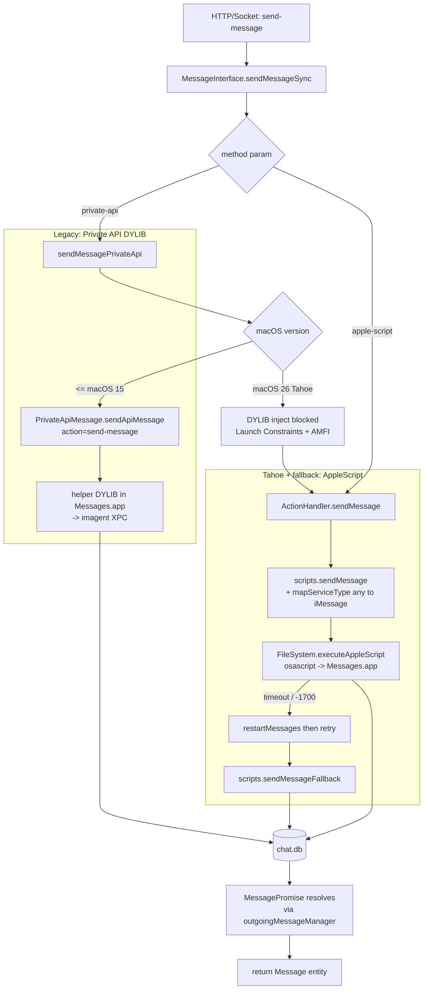

# iMessage send flow

This document maps how `bluebubbles-server` sends an outbound iMessage from a REST/socket request down to `chat.db`, and how that path diverges on macOS 26 (Tahoe). The split is driven by the kernel-level Launch Constraints introduced in Tahoe, which killed DYLIB injection into `Messages.app` / `imagent` — see [`research/2026-04-14-private-api-tahoe.md`](../research/2026-04-14-private-api-tahoe.md). On older macOS the Private API path (DYLIB hook) is the preferred high-fidelity sender; on Tahoe that path is gone, so all sends fall back to AppleScript driving `Messages.app`, with `ax-helper` covering adjacent UI actions (tapback, mark-read, navigate) that the Private API used to handle.

Important: as of this writing **`ax-helper` does NOT implement send.** Inspect `packages/server/appResources/ax-helper/Sources/main.swift` — the only commands are `tapback`, `mark-read`, `navigate`, `check`. Send on Tahoe still goes through `ActionHandler.sendMessage` → AppleScript (`packages/server/src/server/api/apple/scripts.ts::sendMessage`) with the `mapServiceType` GUID fix patching `any;-;` back to `iMessage` for the `service type` parameter. A pure-AX send path (focus compose field, set value, simulate Return) is described as plausible in `research/2026-04-14-ax-typing-indicators.md` but is **research/proposed**, not shipped.

Out of scope: inbound message receive (chat.db poller in `databases/imessage/`), webhook outbound delivery (`services/webhookService` — see [`webhook-delivery.md`](./webhook-delivery.md)), and Private API attachment sends (`PrivateApiAttachment`).

## Send-path decision tree

## Path comparison

| Path                                   | OS                           | Mechanism                                                                                                                                                               | Reliability                                                      | Primary failure mode                                                     |
| -------------------------------------- | ---------------------------- | ----------------------------------------------------------------------------------------------------------------------------------------------------------------------- | ---------------------------------------------------------------- | ------------------------------------------------------------------------ |
| Legacy Private API                     | <= macOS 15 (Sonoma/Sequoia) | DYLIB injected into `Messages.app`, XPC to `imagent`, called via `PrivateApiMessage.sendApiMessage("send-message", ...)`                                                | High — supports effects, subjects, attributedBody, edit/unsend   | DYLIB load fails, helper socket disconnect                               |
| AppleScript (default + Tahoe fallback) | All; required on macOS 26    | `ActionHandler.sendMessage` → `scripts.ts::sendMessage` with `mapServiceType` → `osascript` driving `Messages.app`; one-retry-after-restart, then `sendMessageFallback` | Medium — text + simple attachments only; no effects, no subjects | AppleScript timeout, error -1700 (bad service type), Messages.app wedged |
| ax-helper (NOT for send today)         | macOS 13+; targeted at Tahoe | Swift CLI in `appResources/ax-helper/`, invoked by `services/AxService.ts` via `execFile` with a 5s timeout and `Sema(1)` queue                                         | N/A for send                                                     | Permission denied, `messages_not_running`, AX action missing             |

## Failure modes

- **TCC / Accessibility not granted** — `MessagesApp.checkAccessibility()` in `ax-helper/Sources/main.swift` exits with `permission_denied`; `AxService.exec` rejects with that string and the HTTP layer surfaces it. Send itself is unaffected today (AppleScript path), but tapback/mark-read/navigate fail. Re-grant flow lives in the openclaw-infra repo (`docs/runbooks/bb-tcc-regrant.md`) — same root cause as openclaw-infra #1053 but for a closed app, so re-granting after every BB.app upgrade is the only remediation.
- **Messages.app not running** — ax-helper exits `messages_not_running`; AppleScript path implicitly launches Messages via `tell application "Messages"`, but on Tahoe a fully-quit Messages.app can stall the first send (caught by the timeout/`1002` retry branch in `ActionHandler.sendMessage`).
- **Conversation not findable / GUID mismatch** — On Tahoe, chat GUIDs are stored as `any;-;<addr>` but AppleScript's `service type` only accepts `iMessage|SMS|RCS`. Without `mapServiceType` (`apple/scripts.ts:16`) the script throws error -1700. Symptom: `ActionHandler.sendMessage` falls through to `sendMessageFallback`, which only works for DMs, then re-throws.
- **ax-helper crash / non-zero exit** — `AxService.exec` parses stdout JSON regardless of exit code; if `result.ok === false` it rejects with `result.error`, otherwise classifies `ETIMEDOUT`/`SIGTERM` as `"timeout"`. Send today is not gated on this — only AX-driven endpoints (`/api/v1/ax/*`) are.
- **Confirmation source** — Send is **not** synchronous over a real ack from `imagent`. `MessageInterface.sendMessageSync` registers a `MessagePromise` against `Server().messageManager` keyed on `(chatGuid, text, sentAt)`, then awaits resolution from the chat.db poller in `databases/imessage/`. Both Private API and AppleScript paths land in chat.db; both rely on the poll to resolve the awaiter.

## Related

- [`docs/research/2026-04-14-private-api-tahoe.md`](../research/2026-04-14-private-api-tahoe.md) — why DYLIB injection / `imagent` XPC are dead on Tahoe
- [`docs/research/2026-04-14-ax-typing-indicators.md`](../research/2026-04-14-ax-typing-indicators.md) — AX prototype results; SetValue-vs-keystroke open question for typing/send-via-AX
- [`docs/research/2026-04-14-headless-operation.md`](../research/2026-04-14-headless-operation.md) — FDA propagation and headless-mode blockers
- [`webhook-delivery.md`](./webhook-delivery.md) — outbound notification flow once a message lands in chat.db
- [README — Fork Changes / Tahoe Fixes](../../README.md#macos-26-tahoe-fixes) — shipped fixes (#18 GUID, #19 attributedBody, #43 ax-helper)
- `packages/server/src/server/api/interfaces/messageInterface.ts` — `sendMessageSync` entry point
- `packages/server/src/server/api/apple/actions.ts` — AppleScript send + retry/fallback
- `packages/server/src/server/api/apple/scripts.ts` — `mapServiceType`, `sendMessage`, `sendMessageFallback`
- `packages/server/src/server/api/privateApi/apis/PrivateApiMessage.ts` — Private API send (legacy macOS only)
- `packages/server/appResources/ax-helper/Sources/main.swift` — ax-helper command set (no `send` today)
- `packages/server/src/server/services/AxService.ts` — Node-side ax-helper invoker
- openclaw-infra `docs/imessage-setup.md` — one-way integration from openclaw-infra side (BlueBubbles channel, private-network allow, TCC re-grant after BB.app upgrade)

_Last updated: 2026-05-03_
