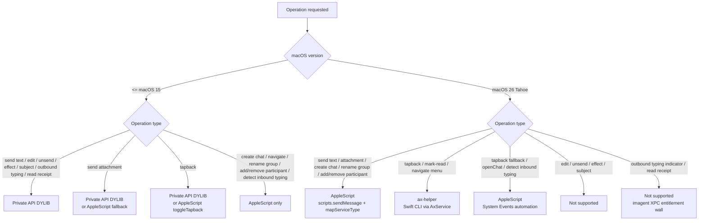

# Private API vs AppleScript vs ax-helper — operational ownership grid

This document answers a single question: **for a given iMessage operation on a given macOS version, which subsystem actually does the work?** It is a 2D grid (operation × macOS version) plus a short decision flowchart.

**In scope**

- Which of the three subsystems (Private API DYLIB, AppleScript via `osascript`, ax-helper Swift CLI) owns each operation.
- macOS-version splits driven by Tahoe's Launch Constraints / XPC entitlement wall.
- What is genuinely "not supported on Tahoe" vs. "moved to a different subsystem".

**Out of scope**

- Send-path internals (request → `chat.db` → `MessagePromise` resolution): see [`imessage-send-flow.md`](./imessage-send-flow.md).
- Outbound webhook delivery once a message lands in `chat.db`: see [`webhook-delivery.md`](./webhook-delivery.md).
- Inbound chat.db polling and `attributedBody` decoding.

## Operation × macOS grid

Verified against `packages/server/src/server/api/privateApi/apis/PrivateApiMessage.ts`, `packages/server/appResources/ax-helper/Sources/main.swift`, and `packages/server/src/server/api/apple/scripts.ts`.

| Operation                                    | ≤ macOS 15 (Sonoma / Sequoia)                                                                             | macOS 26 Tahoe                                                                                     |
| -------------------------------------------- | --------------------------------------------------------------------------------------------------------- | -------------------------------------------------------------------------------------------------- |
| Send text                                    | Private API DYLIB (`PrivateApiMessage.send`)                                                              | AppleScript (`scripts.sendMessage` + `mapServiceType`); `sendMessageFallback` is DM-only           |
| Send attachment                              | Private API DYLIB (`PrivateApiAttachment.send`, supports `effectId`/`subject`)                            | AppleScript (`scripts.sendMessage` with attachment param, or legacy `sendAttachmentAccessibility`) |
| Create new chat                              | AppleScript (`scripts.startChat`)                                                                         | AppleScript (`scripts.startChat`)                                                                  |
| Send with effect (slam, etc.)                | Private API DYLIB (`send`/`PrivateApiAttachment.send` with `effectId`)                                    | **Not supported** (AppleScript path has no effect param)                                           |
| Send with subject                            | Private API DYLIB (`send`/`PrivateApiAttachment.send` with `subject`)                                     | **Not supported** (AppleScript path has no subject param)                                          |
| Edit message                                 | Private API DYLIB (`PrivateApiMessage.edit`)                                                              | **Not supported** (no DYLIB; no AppleScript equivalent)                                            |
| Unsend message                               | Private API DYLIB (`PrivateApiMessage.unsend`)                                                            | **Not supported** (no DYLIB; no AppleScript equivalent)                                            |
| Tapback (react)                              | Private API DYLIB (`PrivateApiMessage.react`); AppleScript fallback `scripts.toggleTapback` is also wired | ax-helper (`tapback <type>`); AppleScript `toggleTapback` may also work via System Events          |
| Mark chat as read                            | Private API DYLIB                                                                                         | ax-helper (`mark-read`)                                                                            |
| Navigate prev/next conversation              | AppleScript (`scripts.openChat` — selects chat row by name)                                               | ax-helper (`navigate next\|prev` — menu-bar press; `openChat` may still work via System Events)    |
| Group-chat rename / add / remove participant | AppleScript (`scripts.renameGroupChat`, `addParticipant`, `removeParticipant`)                            | AppleScript (same — these are pure scripting-dictionary verbs)                                     |
| Detect inbound typing                        | AppleScript AX read (`scripts.checkTypingIndicator`)                                                      | AppleScript AX read; behavior on Tahoe not separately verified                                     |
| Typing indicator (outbound send)             | Private API DYLIB (XPC to `imagent`)                                                                      | **Not supported** — see callouts                                                                   |
| Read receipts (delivered ack)                | Private API DYLIB (XPC to `imagent`)                                                                      | **Not supported** — see callouts                                                                   |

Notes on cell precision:

- **Tapback dispatch policy (option A, [#66](https://github.com/markthebest12/bluebubbles-server/issues/66)):** `MessageInterface.sendReaction` routes by macOS version — `isMinTahoe` → ax-helper (`tapback <heart|thumbsup|...>`); otherwise → Private API DYLIB (`PrivateApiMessage.react`). The legacy `scripts.toggleTapback` AppleScript path remains in the codebase but is not on the main reaction route; it can be removed in a follow-up after a soak period. Note: ax-helper has no remove-tapback semantic, so negative reactions (`-love`, etc.) raise an explicit error on Tahoe instead of silently downgrading.
- **Navigate ≤ macOS 15** uses `scripts.openChat` (UI traversal to select a chat row by name), not Private API. Pre-Tahoe deployments did not call the ax-helper `navigate` menu-bar press at all.
- **`sendMessageFallback` constraint**: the fallback path throws on `chat`-prefixed GUIDs (`scripts.ts:213+`). On Tahoe where group GUIDs always start with `chat`, hitting the fallback path for a group send is a hard error — the primary `sendMessage` path must succeed for groups.
- **Detect inbound typing** is a separate operation from sending an outbound typing indicator. AppleScript can read the AX tree to detect inbound typing today; it cannot push outbound typing on Tahoe without `imagent` XPC.

## Decision flowchart

## Per-subsystem capability summary

### Private API DYLIB (`PrivateApiMessage.ts`)

- Mechanism: DYLIB injected into `Messages.app`; XPC to `imagent`; helper socket from Node.
- Verified operations: `send`, `sendMultipart`, `react`, `edit`, `unsend`, `getEmbeddedMedia`, `notify`, `search`.
- Coverage: highest fidelity — supports effects, subjects, `attributedBody`, partIndex, edit/unsend.
- Status on Tahoe: **dead**. Launch Constraints (kernel-level trust cache, AMFI-enforced) prevent DYLIB load; `imagent` XPC requires Apple-private entitlements. No bypass known. See [`research/2026-04-14-private-api-tahoe.md`](../research/2026-04-14-private-api-tahoe.md).

### AppleScript (`apple/scripts.ts` + `apple/actions.ts`)

- Mechanism: `osascript` driving `Messages.app` via the Messages scripting dictionary, plus System Events automation for operations the dictionary does not expose.
- Verified send operations: `sendMessage`, `sendMessageFallback` (DM-only — throws on `chat`-prefixed GUIDs), `sendAttachmentAccessibility`, `startChat`.
- Verified UI operations: `openChat` (chat-row selection), `renameGroupChat`, `addParticipant`, `removeParticipant`, `toggleTapback` (System Events `AXShowMenu` + keyboard simulation), `checkTypingIndicator` (inbound-typing AX read).
- Coverage gaps: **no** effect, subject, edit, unsend, or outbound-typing support — the Messages scripting dictionary does not expose those verbs and System Events has no equivalent UI gesture.
- Tahoe-specific fix: `mapServiceType` rewrites Tahoe's `any;-;` chat-GUID service component back to `iMessage` so the AppleScript `service type` predicate doesn't throw error -1700. See README §macOS 26 Tahoe Fixes (#18).

### ax-helper (`appResources/ax-helper/Sources/main.swift`)

- Mechanism: standalone Swift CLI invoking `ApplicationServices` (`AXUIElement`) against `Messages.app`. Invoked from Node by `services/AxService.ts` (`execFile`, 5s timeout, `Sema(1)` queue).
- Verified commands (exhaustive): `tapback <heart|thumbsup|thumbsdown|haha|emphasis|question>`, `mark-read`, `navigate <next|prev>`, `check`.
- Permission: macOS Accessibility (TCC). Re-grant required after every BlueBubbles.app upgrade because TCC keys grants on `(path, code signature)`. See [`openclaw-infra/docs/runbooks/bb-tcc-regrant.md`](https://github.com/markthebest12/openclaw-infra/blob/main/docs/runbooks/bb-tcc-regrant.md) for the procedure.
- Background-capable: yes — verified by the typing-indicator prototype ([`research/2026-04-14-ax-typing-indicators.md`](../research/2026-04-14-ax-typing-indicators.md)). Messages.app does not need to be foreground.
- **Not implemented today:** `send`. A pure-AX send path (focus compose field → SetValue → simulate Return) is plausible per the AX research doc but is not shipped.

## "Not supported on Tahoe" callouts

These operations have no working subsystem on macOS 26 today:

- **Outbound typing indicators** — Required XPC into `imagent` (DYLIB path). Tahoe blocks both DYLIB injection and `imagent` XPC for third-party processes. AX `SetValue` on the compose field may or may not trigger a remote typing indicator — pending manual verification (Scenario A vs. B in the AX research doc). If verified, this becomes an ax-helper extension.
- **Read receipts (sending)** — Same root cause: `imagent` XPC entitlement wall. No AX equivalent — read-receipt dispatch is not exposed in the Messages.app UI tree.
- **Edit / unsend** — Private API only; the Messages scripting dictionary has no edit/unsend verbs and the operations are not exposed as discrete AX actions on message bubbles (only the six tapback reactions are).
- **Effects + subjects** — Private API only; AppleScript `send` has neither parameter.

If/when openclaw/openclaw#46685-class workarounds emerge or Apple ships entitlements for third-party clients, this grid changes. Until then, treat the "Not supported" cells as architectural, not as bugs.

## Related

- [`imessage-send-flow.md`](./imessage-send-flow.md) — send-path internals from HTTP/socket request through `chat.db` and `MessagePromise` resolution.
- [`webhook-delivery.md`](./webhook-delivery.md) — outbound delivery once a message lands.
- [`research/2026-04-14-private-api-tahoe.md`](../research/2026-04-14-private-api-tahoe.md) — Launch Constraints, `imagent` entitlement wall, why DYLIB is dead.
- [`research/2026-04-14-ax-typing-indicators.md`](../research/2026-04-14-ax-typing-indicators.md) — AX prototype results; SetValue-vs-keystroke open question.
- [`research/2026-04-14-headless-operation.md`](../research/2026-04-14-headless-operation.md) — background-capable verification, FDA propagation constraints, why ax-helper can run while Messages.app is not foreground.
- [README §macOS 26 Tahoe Fixes](../../README.md#macos-26-tahoe-fixes) — shipped fixes (#18 GUID mapping, #19 attributedBody, #43 ax-helper).
- `packages/server/appResources/ax-helper/Sources/main.swift` — authoritative ax-helper command set.
- `packages/server/src/server/api/privateApi/apis/PrivateApiMessage.ts` — authoritative Private API surface.
- `packages/server/src/server/api/apple/scripts.ts` — `sendMessage`, `sendMessageFallback`, `mapServiceType`.

_Last updated: 2026-05-03_
