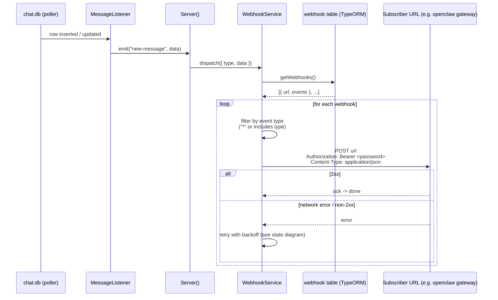
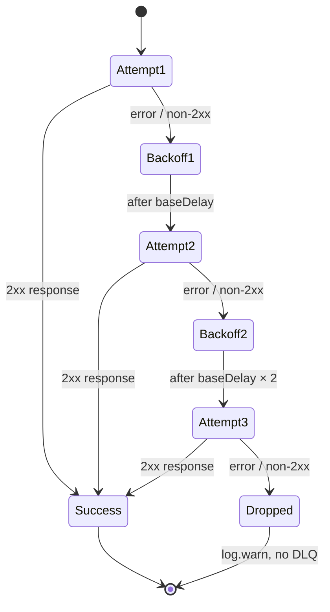

# Webhook delivery

This document describes how `bluebubbles-server` notifies HTTP subscribers (such as the openclaw gateway) when an iMessage event happens — a new message arrives, a message is updated, a chat is renamed, etc. Audience: someone debugging "the openclaw gateway didn't receive a message".

The dispatch path is short. The iMessage database listeners (`packages/server/src/server/api/imessage/listeners/`) poll `chat.db` and emit typed events. `Server()` forwards each event to `WebhookService.dispatch()` (called from `packages/server/src/server/index.ts` near the bottom of the listener wire-up), which loads every row from the `webhook` table, filters by event type, and POSTs the payload to each subscriber URL.

**Retry IS shipped.** Issue #15 / PR #24 (`fix: add exponential backoff retry for webhook delivery`, merged 2026-04-14) replaced the original fire-and-forget call with an in-process retry loop: 3 attempts with exponential backoff (1s, 2s, then a final attempt). Auth header support (Issue #11) is also shipped — every outbound POST carries `Authorization: Bearer <server-password>` when a password is configured. There is still no persistent dead-letter queue: if all 3 attempts fail, the failure is logged and the event is dropped.

## Event → subscriber dispatch

## Retry state machine (shipped, Issue #15 / PR #24)

Delay formula: `baseDelayMs * 2^(attempt-1)` with `baseDelayMs = 1000` (i.e. 1s before attempt 2, 2s before attempt 3). The class property `retryBaseDelayMs` on `WebhookService` is the override injection point used by tests; `sendPost` aliases it locally as `baseDelayMs`. After attempt 3 the rejection bubbles out of `sendPost`; the caller in `dispatch()` catches it and writes a `Failed to dispatch "<type>" event to webhook after retries: <url>` warning.

## Current vs original behavior

| Aspect                        | Original (pre-#15)           | Current (shipped, PR #24)                                      |
| ----------------------------- | ---------------------------- | -------------------------------------------------------------- |
| Retries                       | None — fire-and-forget       | 3 attempts total                                               |
| Backoff                       | N/A                          | Exponential: 1s, 2s before final                               |
| Dead-letter                   | N/A                          | None — failure is logged and dropped                           |
| Logging                       | Single warn on first failure | `debug` per retry, `warn` after final failure with status text |
| Auth header                   | None (pre-#11)               | `Authorization: Bearer <password>` when configured (#11)       |
| Subscriber removal on failure | Never                        | Never — webhook row stays in DB                                |

## Debugging tips

- On the BB-server side, grep the server log for `WebhookService`. The terminal failure line is the always-visible signal: `Failed to dispatch "<type>" event to webhook after retries: <url>` is emitted at `warn` level and will appear in production logs by default. The earlier markers — `Dispatching event to webhook: <url>` (every dispatch attempt) and `Webhook delivery failed (attempt N/3)` (each retry) — are emitted at `debug` level and require enabling debug logging in the BB server settings to be visible. If you grep for `Dispatching` and find nothing, that does NOT prove dispatch never ran; check the `warn`-level line first.
- Subscriber list is the `webhook` table in the server's TypeORM SQLite database (entity: `packages/server/src/server/databases/server/entity/Webhook.ts`). Inspect via the BB-server UI's Webhooks page or query the DB directly. Each row stores `url` and a JSON-encoded `events` array; `["*"]` means "all events".
- The auth header is the server password (`Server().repo.getConfig("password")`), NOT a dedicated webhook secret. If gateway-side auth fails, confirm the BB-server password matches what the gateway expects.
- On the gateway side, correlate by timestamp with the inbound webhook handler log on the openclaw gateway (BlueBubbles channel) — a BB-side `Failed to dispatch ... after retries` with no matching gateway-side receive entry confirms the message never landed; a successful BB-side dispatch but no gateway entry points to a gateway routing/auth issue rather than a delivery issue.

## Related

- [`imessage-send-flow.md`](./imessage-send-flow.md) — how a message lands in chat.db in the first place (which then triggers the listener emit above)
- README — Fork Changes → Webhook retry (#15) and Auth header (#11): [../../README.md](../../README.md)
- Plan — Issue #15 task and rollout: [`../superpowers/plans/2026-04-13-ci-pipeline-and-fixes.md`](../superpowers/plans/2026-04-13-ci-pipeline-and-fixes.md)
- Spec — design context for the CI + fixes batch: [`../superpowers/specs/2026-04-13-ci-pipeline-and-fixes-design.md`](../superpowers/specs/2026-04-13-ci-pipeline-and-fixes-design.md)
- Implementation: `packages/server/src/server/services/webhookService/index.ts`
- Subscriber entity: `packages/server/src/server/databases/server/entity/Webhook.ts`
- Gateway-side receiving end (openclaw-infra): `docs/imessage-setup.md` in the openclaw-infra repo

_Last updated: 2026-05-03_
